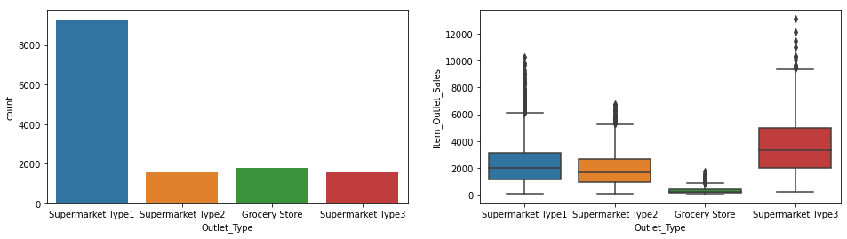

## Project Overview

### Problem Statement
Sales data of 1559 items across 10 stores in different locations have been collected in the year 2013. Each product has certain attributes that sets it apart from other products. Same is the case with each store.

The goal is to build a predictive model to find out the sales of each product at a particular store.

Dataset: [big mart part 1](data/train.csv)  
&nbsp;&nbsp;&nbsp;&nbsp;&nbsp;&nbsp;&nbsp;&nbsp;&nbsp;&nbsp;&nbsp;&nbsp;&nbsp;&nbsp;[big mart part 2](data/test.csv)  
Python notebook: [Big mart EDA/regression modeling](BigMart%20Sales.ipynb)  

## Metadata  
The dataset has 12 columns with 1 column being an item identifier and the remaining columns being details of the item and the details of the outlet it was sold at.   
part 1 of the dataset has 8523 rows of data while part 2 has 5681 rows of data.  

__Item_Identifier__: unique product ID  
__Item_Weight__: weight of product  
__Item_Fat_Content__: whether the product is low fat or not  
__Item_Visibility__: the % of total display area of all products in a store allocated to the particular product   
__Item_Type__: the category to which the product belongs  
__Item_MRP__: maximum retail price (list price) of the product  
__Outlet_Identifier__: unique store ID  
__Outlet_Establishment_Year__: the year in which store was established  
__Outlet_Size__: the size of the store in terms of ground area covered  
__Outlet_Location_Type__: the type of city in which the store is located    
__Outlet_Type__: whether the outlet is just a grocery store or some sort of supermarket   
__Item_Outlet_Sales__: sale of the product in the particular store. <ins>This is also the outcome variable to be predicted</ins>  

## Data Exploration/Visualisation
I join the two-part dataset to get the full pictures when doing exploration.    

#### Data Overview
  

There are null values which I look to clean up before exploring.  
  

2439 missing values for Item_Weight  
4016 missing values for Outlet_Size  
The 5681 missing Item_Outlet_Sales values is the target variable to be predicted in test.csv  

Some summary statistics of our features:  
  

#### Target variable Item_Outlet_Sales distribution:   
  

Target variable is right skewed.  
 

#### Numeric Features distribution:
  
- Item_Weight has some missing values. Based on the distribution, we can just go with a simple mean imputation.  
- Item_Visibility has an large number of 0s. Also, 0% Item Visibility doesn't quite make sense. A segment of items with <2000 sales have more visibility (0.2 - 0.34) than the majority of items.  
- Item_MRP (Max Retail Price) has a positive linear relationship with Item_Outlet_Sales. There also seems to be 4 distinguished Item_MRP ranges.  
 

#### Categorical Features Overview: 
  
Dataset has 14204 rows.  

#### No. of Unique Item Identifiers.
  
There are 1559 unique Item Identifiers but 14204 rows. This means that all outlets carry the same 1559 items.  

#### Outlet Establishment Year distribution:  
  
 

#### Item Fat Content distribution:
    

I do some cleaning by standardizing the categorizations to 'Low Fat' and 'Regular'.    

#### Item Fat Content distribution after cleaning:
    
 

Interestingly, all items have a fat content even if they are not food related.    

#### Item Type distribution:

There are 16 Item Categories with some categories having very low item counts such as "Breakfast", "Starchy Foods", "Seafood", etc.    

#### Outlet Identifier distribution:

 

Interestingly, all stores except OUT010 and OUT019 have close to the unique number of Item_Identifiers of 1559 despite having varying Outlet_Sizes, Outlet_Location_Types and Outlet_Types.  
OUT010 and OUT019 have fewer Items in their stores. The sales distribution also has a smaller range as compared to the other outlets.  
Although the rest of the outlets have approximately the same items, OUT027 seems to be outperforming them.  
The remaining outlets are somewhat even in sales distribution.  

#### Outlet Size distribution

There are fewer 'High' Outlet_Sized outlets.  
There are missing Outlet_Size values. Going with mode imputation, we will have more 'Medium' Outlet_Size values.  

#### Outlet Location Type distribution

Tier 3 outlets have more items with higer sales on the more extreme end.    

#### Outlet Type distribution

Overwhelming number of Supermarket Type1 stores compared to the other Outlet_Types.  
Grocery Stores have lower sales and Supermarket Type3s have better sales/  

#### Outlet Establishment Year/Outlet Identifier against Sales

The boxplot's distribution for 1998 looks similar to that of the Outlet_Type 'Grocery Store' in the Outlet Type distribution boxplot.    
This is also the case for the sales distribution for Outlet_Identifier 'OUT010' and 'OUT019' (probably Grocery Stores).    

#### Outlet Establishment Year/Outlet Type against Sales

We note 1985's Grocery Store and Supermarket Type3's individual distributions and 1998's Grocery Store distribution to be that of 'OUT010' and 'OUT019' 
The genesis of Big Mart came with the opening of Supermarket Type3 and a Grocery Store in 1985.  
2 years later, they opened the first Supermarket Type1.  
Supermarket Type2 is their most recent opened outlet.  

## Data Cleaning
I do somemore data cleaning here.  

### Item Weight

As mentioned earlier that the dataset has 1559 unique Item_Identifiers, all outlets should carry the same 1559 items, hence I am checking if the same Item_Identifiers across other stores have their Item_Weight labeled.  
 

Item Weight per Item_Identifier is the same across all outlets.  
Create pivot table to get mean weight per Item_Identifier.  

#### Pivot Item Identifier against Item Weight

 

 

 

### Outlet Size  
  
Initially, I thought Outlet_Size might be associated with the Outlet_Location_Type and/or Outlet_Type in that:    

- Larger outlet sizes open up the possibility for more traffic and are likely to have a wider variety of items which can have an effect on sales.  
- Customers from Tier 1 Cities may have more spending power than Tier 2 and Tier 3 and so placing a large outlet in Tier 1 Cities may be a strategic decision to capitalize on the higher customer spendings to improve sales.  
After seeing all Outlets apart from Grocery Stores have close to the total unique Item_Identifiers in their outlets and looking at their sales distributions, a clear pattern may not be easily discernible.  
 

Create catplots with Outlet_Size, Outlet_Location_Type and Outlet_Type against Item_Outlet_Sales to see where our 3 outlets with missing Outlet_Size can potentially fit in.  

 

 
We note the insufficient examples in feature combinations to make out any conclusive patterns. However, the most discernable pattern seems to be from differing Outlet_Types, while the Outlet_Size not having any effect on sales.  
 

#### Outlet Size/Type comparison with Outlets with missing Outlet Size values

Distribution of Supermarket Type1s are similar in distribution regardless of Outlet_Size.  
Distribution of Small Grocery Store is the same as OUT010.  
Check mode of Outlet_Size for Supermarket Type1 for imputation.  
 

Impute Outlet_Size for OUT045 & OUT017 based on the Outlet_Size mode of Supermarket Type1s.

 

### Item Visibility
As per the metadata,  
Item Visibility: The % of total display area of all products in a store allocated to the particular product.  
The minimum data point of Item_Visibility is 0. Explore this area.  

#### Total Item Visibility per Outlet

Not all 100% of the display area is used per store.  

#### Overview of Zero visibility items

 

Item_Visibility per Item across the different stores have similar Item_Visibility numbers.  
*OUT010 and OUT019 have slightly higher numbers than the other stores.*  
 

Looking for other examples:  

 

Item_Identifier FDM39:  

OUT010 and OUT019 appears to consistently have different Item_Visibility numbers compared to ALL other Outlet_Identifiers.  
The distinguishing factor between the two and the rest of the outlets is the Outlet_Type being 'Grocery_Store'.  

// impute item visibility 0 with item visibility mean by outlet_type to factor for grocery store visibilities being different //
#### Imputing missing Item Visibility rows with mean from pivot table

 
Before imputation:  

 
After imputation:  

 
- All outlets are close to the full display area utilization after mean imputation.     
- OUT010 and OUT019 having 97% utilization might be the difference due to 'Grocery Store' Outlet_Types usually having a higher visibility % compared to the other Outlet_Types as previously discovered.  
 

Try imputation by Outlet_Type/Item_Identifier to see if we can get a total visibility closer to 100%.  

 

40 Items that couldn't be imputed due to lack of (Grocery Store,Item_Identifier) combination from the other grocery store that makes up the pivot table used for imputation.  
These remaining 40 Items will be imputed by the Item_Visibility mean by Item_Identifier.  

#### Total Item Visibility per Outlet after all imputations
  
Item_Visibility values are closer to 100% as compared to before.  
 

#### Item Visibility Distributions after imputation

 

#### Item Visibility (0.2 - 0.34)
Lastly, we investigate the segment of items with <2000 sales that have more visibility (0.2 - 0.34) than the majority of items:  

The items with Item_Visibility > 0.2 are from Outlet_Type 'Grocery Store' as they have fewer items (900+) compared to the supermarkets (1500+).   

### Item Fat Content
Earlier, we noted that all items have a fat content even if they are not food related. To investigate, we first look at the categories in Item_Type:   

 

Health and Hygiene is unlikely to be food that have a fat content:  

We note the Item_Identifier prefix for Item_Types 'Health & Hygiene'.  
 

__All__ 'Health and Hygiene' Item_Types are considered Low Fat even though they are likely inedible.   
 

Item_Type Household, Health & Hygiene & Others all have the prefix 'NC' in their Item_Identifiers.  
Looking back, there are 2 other prefixes for our Item_Identifiers, 'FD' and 'DR'.  
 

These are all Item_Type Food related categories.  
 

These are all Item_Type drinks related categories and one dairy category.  
 

#### Correlation Heatmap of our features.

Apart from Item_MRP and Item_Visibility to a lower degree, we observe negligible correlation with our target variable sales.
 

## Feature Engineering
Based on the exploration and data cleaning, I have some things in mind that I would like to change about our data in hopes of making certain features better distinguish our sales:  
- Set Item Fat Content accordingly for non-food Item_Type items.  
- Add an outlet age variable based on each outlet's 'Outlet_Establishment_Year'.    
- Item_Type has 16 different categories with similar sales distribution. Combine some of them together.  

### Item Fat Content
Looking back at Item_Fat_Content for Item_Identifiers prefixed with 'NC', I set these to 'No Fat Content'.  

Not very distinguishable in terms of sales.  
 

### Outlet Age

We use 2013 because this dataset was collected in 2013 as mentioned in the problem statement.  

### Item Type New
Recalling that our Item_Identifiers have 3 different prefixes, 'FD', 'DR' and 'NC' which are linked to Item_Types Food, Drinks and Household/Hygiene/Others, we can interpret these prefixes as 'Food', 'Drinks', 'Non-Consumables'.  

 

Again not very distinguishable in terms of sales.  

## Pre-processing / Modeling
I prepare my data for modeling here.  

Firstly, I split the dataframe into the training sets.   
Next, I drop the 'Item_Identifier', 'Item_Type' and 'Outlet_Establishment_Year' features as there are 1559 Item_Identifiers, we have 'Item_Type_New' and 'Outlet_Age' in place of 'Item_Type' and 'Outlet_Establishment_Year'.    
Afterwhich, I one hot encode 'Outlet_Identifier','Item_Fat_Content','Outlet_Size','Outlet_Location_Type','Outlet_Type' and 'Item_Type_New'.    
Lastly, I do a train-test split of 80-20 on the training data set to get my training and validation sets.  

Root Mean Squared Error (RMSE) will be used as the scoring method for this predictive model.  

### Null model
I use the mean of sales for all prediction values as a null model.   
  
RMSE of 1702 on train and 1721 on validation.   

### Linear Regression model
    
Linear regression gives us a better RMSE of 1124/1141 for the train/valid sets. They are relatively close together so I don't believe the model to be overfitting.    
 

The residuals are normally distributed with a slight negative skew of -0.395. However, the residual plot shows a funnel shaped pattern which is an indication of heteroscedasticity (non constant variance in residuals).  
 

Outlet_Type 'Supermarket Type1' and Outlet_Size 'Small' make up the largest positive/negative coefficients in our Linear Regression model for predicting sales which make some sense as Small Outlet_Size is associated with Grocery Stores that have an overall lower amount of sales.  

I try to improve the RMSE by using regularized models:  

#### Ridge Regression model

Ridge regression gives us just about the same r square and RMSE.  

We see that the ridge model has shrunk the majority of our feature coefficients to smaller values and given more weight to the more 'important' features. Outlet_Type 'Supermarket Type1' remain at the top but have smaller coefficients, but Item_MRP has greater significance in the ridge regression model.  

#### Lasso Regression model

Lasso regression gives us a similar r square and RMSE.  
  
We see that the lasso model has shrunk the majority of our feature coefficients to negligible values near 0 and given more weight to the top features.    

#### Log Transformed DV for Linear Regression
To deal with the heteroscedasticity in our data, I log transform the target variable before doing the linear regression.    

However, the RMSE actually worsened instead.  

#### Polynomial Features
I look back to my dataset to introduce polynomial features to a degree of 2 for my numerical features.    
For example, if an input sample is two dimensional and of the form [a, b], the degree-2 polynomial features are [1, a, b, a^2, ab, b^2].    
      
      
 

    
RMSE made a miniscule improvement to 1118/1133 for the train/validation scores.  
 

   
With Polynomial features, we introduced a combination of Item_Visibility and Item_MRP that the model found useful. This might be a factor in the improved RMSE score.  

#### Random Forest model
I try tree based models to capture any non linearity present in the data.    
  
Based on the discrepancy between the training and validation R2/RMSE, we can see that the base RF model is severely overfitting the data.    
 

RF_rand train r2: 0.7013258685185819
RF_rand valid r2: 0.591484530411218
RF_rand train rmse: 930.3748856593513
RF_rand valid rmse: 1100.4407749540576
The random search hyperparameter tuning resulted in an overall better RMSE on the validation set and also a smaller gap between the training/validation sets.  
 

