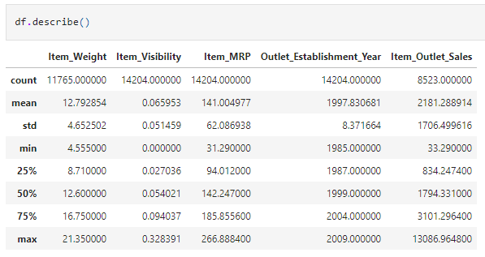
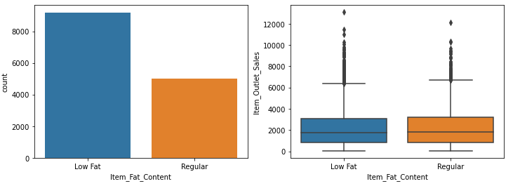

## Project Overview

### Problem Statement
Sales data of 1559 items across 10 stores in different locations have been collected in the year 2013. Each product has certain attributes that sets it apart from other products. Same is the case with each store.

The goal is to build a predictive model to find out the sales of each product at a particular store.

Dataset: [big mart part 1](data/train.csv)  
&nbsp;&nbsp;&nbsp;&nbsp;&nbsp;&nbsp;&nbsp;&nbsp;&nbsp;&nbsp;&nbsp;&nbsp;&nbsp;&nbsp;[big mart part 2](data/test.csv)  
Python notebook: [Big mart EDA/regression modeling](BigMart%20Sales.ipynb)  

## Metadata  
The dataset has 12 columns with 1 column being an item identifier and the remaining columns being details of the item and the details of the outlet it was sold at.   
part 1 of the dataset has 8523 rows of data while part 2 has 5681 rows of data.  

__Item_Identifier__: unique product ID  
__Item_Weight__: weight of product  
__Item_Fat_Content__: whether the product is low fat or not  
__Item_Visibility__: the % of total display area of all products in a store allocated to the particular product   
__Item_Type__: the category to which the product belongs  
__Item_MRP__: maximum retail price (list price) of the product  
__Outlet_Identifier__: unique store ID  
__Outlet_Establishment_Year__: the year in which store was established  
__Outlet_Size__: the size of the store in terms of ground area covered  
__Outlet_Location_Type__: the type of city in which the store is located    
__Outlet_Type__: whether the outlet is just a grocery store or some sort of supermarket   
__Item_Outlet_Sales__: sale of the product in the particular store. <ins>This is also the outcome variable to be predicted</ins>  

## Data Exploration/Visualisation
I join the two-part dataset to get the full pictures when doing exploration.    

#### Data Overview
  

There are null values which I look to clean up before exploring.  
  

2439 missing values for Item_Weight  
4016 missing values for Outlet_Size  
The 5681 missing Item_Outlet_Sales values is the target variable to be predicted in test.csv  

Some summary statistics of our features:  
  

#### Target variable Item_Outlet_Sales distribution:   
  

Target variable is right skewed.  
 

#### Numeric Features distribution:
  
Item_Weight has some missing values. Based on the distribution, we can just go with a simple mean imputation.  
Item_Visibility has an large number of 0s. Also, 0% Item Visibility doesn't quite make sense. A segment of items with <2000 sales have more visibility (0.2 - 0.34) than the majority of items.  
Item_MRP (Max Retail Price) has a positive linear relationship with Item_Outlet_Sales. There also seems to be 4 distinguished Item_MRP ranges.  
 

#### Categorical Features Overview: 
  
Dataset has 14204 rows.  

#### No. of Unique Item Identifiers.
  
There are 1559 unique Item Identifiers but 14204 rows. This means that all outlets carry the same 1559 items.  

#### Outlet Establishment Year distribution:  
  
 

#### Item Fat Content distribution:
    

I do some cleaning by standardizing the categorizations to 'Low Fat' and 'Regular'.    

#### Item Fat Content distribution after cleaning:
    
 

Interestingly, all items have a fat content even if they are not perishables.    

#### Item Type distribution:

There are 16 Item Categories with some categories having very low item counts such as "Breakfast", "Starchy Foods", "Seafood", etc.    

#### Outlet Identifier distribution:

 

Interestingly, all stores except OUT010 and OUT019 have close to the unique number of Item_Identifiers of 1559 despite having varying Outlet_Sizes, Outlet_Location_Types and Outlet_Types.  
OUT010 and OUT019 have fewer Items in their stores. The sales distribution also has a smaller range as compared to the other outlets.  
Although the rest of the outlets have approximately the same items, OUT027 seems to be outperforming them.  
The remaining outlets are somewhat even in sales distribution.  

#### Outlet Size distribution

There are fewer 'High' Outlet_Sized outlets.  
There are missing Outlet_Size values. Going with mode imputation, we will have more 'Medium' Outlet_Size values.  

#### Outlet Location Type distribution

Tier 3 outlets have more items with higer sales on the more extreme end.    

#### Outlet Type distribution

Overwhelming number of Supermarket Type1 stores compared to the other Outlet_Types.  
Grocery Stores have lower sales and Supermarket Type3s have better sales/  

#### Outlet Establishment Year/Outlet Identifier against Sales

The boxplot's distribution for 1998 looks similar to that of the Outlet_Type 'Grocery Store' in the Outlet Type distribution boxplot.    
This is also the case for the sales distribution for Outlet_Identifier 'OUT010' and 'OUT019' (probably Grocery Stores).    

#### Outlet Establishment Year/Outlet Type against Sales

We note 1985's Grocery Store and Supermarket Type3's individual distributions and 1998's Grocery Store distribution to be that of 'OUT010' and 'OUT019' 
The genesis of Big Mart came with the opening of Supermarket Type3 and a Grocery Store in 1985.  
2 years later, they opened the first Supermarket Type1.  
Supermarket Type2 is their most recent opened outlet.  

## Data Cleaning
I do somemore data cleaning here.  

