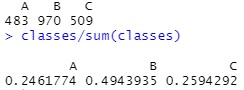
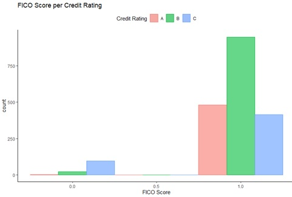
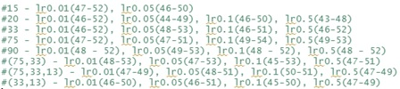
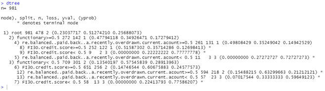

## Project Overview
Banks face the challenge of determining whether a customer is eligible for credit/loans.    
To address this, banks utilize data mining methods to classify customers into risk categories, ranging from the highest rating (category A) to the lowest rating (category C).    
A bank has gathered a dataset consisting of 2500 past credit assessments.  
With this dataset, I will analyze the dataset and use visualizations to gain a better understanding of its overall properties. This analysis will provide insights into the complexity and challenges associated with predicting customer credit ratings.  
I will employ prediction models such as the Multilayer Perceptron (MLP), decision tree, support vector machine, naive bayes and logistic regression to compare their effectiveness at predicting customer's credit ratings.  

Dataset: [creditworthiness dataset](data/creditworthiness.csv)    
R script: [creditworthiness analysis](creditworthiness_prediction.R)    

## Metadata  
The dataset includes 46 customer attributes, with the final attribute (the 47th attribute) representing the assessment outcome, the customer's credit rating.    
The customer attributes as follows:  

__functionary__:   
0:no  
1:yes    

__re-balanced (paid back) a recently overdrawn current acount__  
0:no    
1:yes    

__FICO credit score__  
0:not ok  
1:ok  

__gender__  
0:male  
1:female  

__credit refused in past__  
0:no  
1:yes  

__years employed__  
1:<1  
2:<2  
3:<5    
4:<10  
5:>10  
  
__account balance__  
1:<100  
2:<1.000  
3:<7.500  
4:<10.000  
5:<20.000  
6:>20.000  

__self employed__  
0:no  
1:yes  

__max. account balance X months ago__  
1:<100  
2:<1.000  
3:<7.500  
4:<10.000  
5:<20.000  
6:>20.000  

__min. account balance X months ago__  
1:<100  
2:<1.000  
3:<7.500  
4:<10.000  
5:<20.000  
6:>20.000  
  
__avrg. account balance X months ago__  
1:<100  
2:<1.000  
3:<7.500  
4:<10.000  
5:<20.000  
6:>20.000  

__credit rating__  
0:No credit  
1:A  
2:B  
3:C  
  
## Data Exploration/Visualisation
  
 
There are 2500 rows of customer credit worthiness data. We will first seperate the unlabelled data and analyze the remaining labelled data.  
The labelled data includes credit ratings for 1962 customers, which we know are categorized as A, B, or C, but is represented in the dataset by the numerical codes 1, 2, or 3, respectively.    
The remaining 538 customers' credit rating is now a 0, and need to be classified into one of the above credit rating categories.  
There is no missing data.  

#### Distribution of Class Labels  
  

For visualization purposes I will encode the numerical codes to A, B and C.  
#### Distribution of Class Labels Normalized  
  

Credit rating B is nearly twice the size of A and C. We must take this into account when analyzing data distributions of the 45 attributes with regard to credit rating.  

### Bivariate Analysis with Credit Rating  
#### Functionary  
  
B and C have a higher frequency in 0 compared to 1 while A has a higher frequency in 1 compared to 0.  
Functionary individuals may be more likely to be in credit rating A compared to B and C while non-functionary individuals may be more likely to fall into the category of B or C.  

#### Re-balanaced account  
  
Data is quite heavily skewed towards 1 here with few observations falling under 0. I suppose it could be that people who don’t re-balance their overdrawn accounts have their accounts closed/removed from the banks records, hence they won’t have a credit rating in the first place.  

#### FICO  
  
FICO Score is calculated based on a few variables such as payment history, debts, length of credit history, credit mix, new credit, etc. a good FICO score should theoretically indicate a good credit rating.  
Once again, the distribution is rather skewed towards 1. The same logic as before could apply in that having a poor FICO score could result in the bank closing the customers’ accounts which results in them only keeping customers with a good FICO score.  
A possibility for there being many Credit Rating C individuals having a good FICO score could be that although they are in a poor credit rating position, they have yet to take loans and not pay the money back, or although they overdraw their balances, they still mange to pay the money back one way or another, hence the bank has no reason to close down their accounts.  

#### Gender    
    
An evenly distributed attribute. Does not look to be particularly useful in predicting a credit rating group.     

#### Accounts at other Banks  
    
Another somewhat evenly distributed attribute. Does not look to be particularly useful in predicting a credit rating group.    

#### Credit Refused in the Past  
  
Individuals with credit rating C appear to be more likely to have their credit refused in the past. This attribute could be helpful in predicting individuals with a credit rating of C.  

#### No. of Years Employed  
  
Another evenly distributed attribute. Does not look to be particularly useful in predicting a credit rating group.  

#### Savings in other Accounts    
    
The attribute looks evenly distributed apart from 4, where there are close to no observations for credit rating A and C. This outlier may affect predictions towards individuals whose savings amount in other accounts fall under bin 4.  

#### Self Employed    
    
Almost a perfectly evenly distributed attribute in the ratio 1:2:1 where credit rating B is double of credit rating A and C in both bins 0 and 1. Does not look helpful in predicting a credit rating.  

The remaining attributes are account balances over a timeframe of a year split into months. Individually analyzed, there is unlikely to be interesting insights.   

### Correlation Matrix    
      
      
We observe the attributes with higher correlations with credit rating are: ‘functionary’, ‘re-balance’, ‘FI3O score’, ‘credit refused in past’. These feature likely have higher weightages when it comes to predicting credit ratings.  

### Predictive Modeling  
#### Multilayer Perceptron  
  

The Multilayer Perceptron has been run with the following different parameters to achieve an optimal result.  
#x  = number of neurons in hidden layer  
#(x,y) = 2 hidden layers with x and y being the number of neurons in each layer  
lr = learning rate  
lr0.01(47-52) = 47% to 52% accuracy  
the result is a range of accuracies because they were done on a different number of iterations to achieve the differing results.  
  

I ended up using the following parameters for my final MLP:  
size=33  
learnFuncParams=c(0.05)  
maxit=500  
Results:  
  

  
The black line shows the SSE decreasing as the number of iterations increase, while the red line is the SSE increasing near the very beginning of the training which shows the MLP is severely overfitting on the training dataset.    

   
The plot shows target values on the x-axis and fitted/predicted values on the y-axis. The optimal fit would yield a line through zero with gradient one. This optimal line is shown in black color. A linear fit to the actual data is shown in red color. The fit for the validation data is not a good one.  

  
Which gives an accuracy of 49.1%.

#### Considerations
As we recall in our Bivariate analysis, we noted that the account balances over different time frames with credit ratings did not prove to be particularly distinctive unlike other features such as functionary, Re-balanaced account and FICO score. Let's try reducing the number of features we are feeding the MLP with by removing the account balance over time features.   

#### Re-train MLP with 9 Features  
  

Now we re-train the MLP with the same parameters from before.  
  

    
We see the red line's SSE coming down to about 620 before plateauing, remaining somewhat constant and start to diverge from the direction of the black line after iteration 300 or so which is an indication of the MLP overfitting to the training data.  

    
The red line is a lot closer to the optimal black line which shows an improvement in our model.  

  
Which gives an accuracy of 60.1%. A huge improvement!  

As we noted that the SSE for the validation data started diverging after iteration 300 or so, we can change the MLP's parameter maxit=500 to maxit=300.    

   

     
The red line no longer diverges from the downward trend.  

    
The red line is even closer to the optimal black line than before, showing an improvement to the previous model.  

  
Which gives an accuracy of 63.3%. A slight improvement from the previous model.  

Feeding the MLP many variables does not mean it will have higher prediction accuracy. In fact, it could confuse the MLP with many variables with inconclusive associations to the class label.  

#### Decision Tree
   

   

We get an accuracy of 61.1%, similar to our MLP.  

#### Support Vector Machine  
   

We get an accuracy of 58.6%, a little bit lower than our previous models.  

I perform a brute force hypertuning of the SVM using a gridsearch on the cost and gamma parameters.  
  

  
The hypertuned SVM gives an accuracy score of 60.6%, a slight improvement to the default parameters.  

#### Naive Bayes  
   

  
We get an accuracy of 34%, a very poor model.  

### Evaluating our Models / Conclusion
The decision tree classifier and hypertuned SVM have both a very close accuracy and similar confusion matrices. Overall, the best classifier would be either the decision tree or support vector machine classifier.  
 
Another point to note is that credit.rating ‘3’ appears to be consistently misclassified as ‘2’ for all models apart from the naïve bayes model which looks to be classifying every row as credit.rating ‘1’ regardless of the actual credit.rating. Perhaps the features for credit.rating ‘3’ customers are very much similar to that of credit.rating ‘2’ customers, along with the fact that credit.rating ‘2’ is the dominant class in the class distribution as we noted previously:  
  
