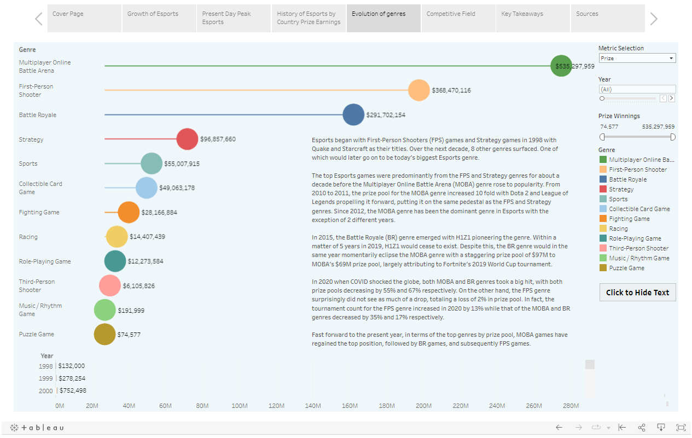

## Project Overview

#### The following is a web scraping exploration project of an Esports website: https://www.esportsearnings.com. The focus of this project is to get an overview of the Esports scene and it's growth over the years. The metric I will be focusing on to measure this growth is Prize Winnings. I scrape all available historical data up till December 2022 using python and save said data into Excel files. After which I load the data files into an SQL database and perform Exploratory Data Analysis on it. Lastly, I extract insightful data from SQL to visualize in Tableau.  

Python notebook: [Web Scraper](scraper.ipynb)  
SQL script: [EDA Script](SQL%20script.sql)  
Tableau Story: [Esports Dashboards](https://public.tableau.com/views/Esports_16739876336460/Esports?:language=en-US&:display_count=n&:origin=viz_share_link)  

## Web Scraping  
From the website: https://www.esportsearnings.com/history, I scrape the following: __Top 500 \[Players, Games, Countries, Teams] per Year/Month__. From this historical data, I extract the following information through my [Python Web Scraper](scraper.ipynb):  
Top __Players__: <ins>\[Rank for the year, Player's ID, Player's Name, Winnings for the year, Winnings in career, Winnings for the year as a percentage of career winnings, Year, Player's Profile (URL)]</ins>      
Top __Games__: <ins>\[Rank for the month/year, Game name, Prize for the month/year, Month, Year]</ins>       
Top __Country__: <ins>\[Rank for the month/year, Country, Prize for the month/year, Player count for the month/year, Month, Year]</ins>      
Top __Teams__: <ins>\[Rank for the month/year, Team, Prize for the month/year, Tournament count for the month/year, Month, Year]</ins>    

From each player in the Top 500 Players per Year, they have a unique Player's Profile (URL) which I use to extract more information about the players. This URL also functions as a foreign key to join multiple tables in SQL later on. I extract each player's __demographic data__ and the player's __career history__ of winnings:  
__Demographics__: <ins>\[Player Name, Player Username, Game Title, Age, Country, Player's Profile (URL)]</ins>  
__Career History__: <ins>\[Year, Prize, Tournament count, Prize as a percentage of Total Prize, Player's Profile (URL)]</ins>  
 

Next, I also collect the following data which is aggregated to date (till Dec 2022): __Top \[Countries, Games/Genre]__.  
Top __Countries__: From https://www.esportsearnings.com/countries, we have the Top Countries by prize money and the number of players who have competed.  
Data scraped: <ins>\[Rank, Country, Prize, Player count, Top Game, Prize for Top Game, Prize for Top Game as a percentage of Total Prize]</ins>   
Top __Games/Genre__: From https://www.esportsearnings.com/games/browse-by-genre, we have all esport games grouped by their genres; for each game, their respective aggregated prize pools, player count and tournament count.  
Data scraped: <ins>\[Game Title, Genre of game title, Prize, Player count, Tournament count]</ins>   
 
Website's Terms of Use: https://www.esportsearnings.com/terms-of-use  

## SQL Exploration/Cleaning
Using the scraped data from above, I clean the data, use joins, CTEs/Subqueries, Aggregate Functions, Window Functions and Views to manipulate the data in SQL, outputing a total of 13 tables of data for visualisation in Tableau. This can be viewed in my [SQL Script](SQL%20script.sql)

<ins>Teams Data</ins>    
Table 1: Top 10 Teams by Prize Money, Tournament count of team, Average Prize per Tournament, Years Active, Tournaments per Year     
Table 2: Top 10 Teams' History of Prize Winnings by Month/Year  
 

<ins>Countries Data</ins>    
Table 3: Top 5 Countries by Prize Winnings, Player count of Country, Top Game of Country, Prize for Top Game, Top Game's prize as a percentage of the Country's total Prize Winnings  
Table 4: Top 5 Countries' History of Prize Winnings and Player count by Month/Year    
Table 10: Top 10 Countries' History of Prize Winnings as Cumulative Sums per Year  
 

<ins>Games Data</ins>  
Table 5: Top 5 Games by Largest Prize Pool aggregated to date with Total Tournaments, Unique Players and Years Active   
Table 6: Top 5 Games' History of Prize Pool and Player/Tournament count by Month/Year  
Table 7: All Games/Genres by Prize Pool, Player/Tournament count aggregated to date    
Table 8: All Genres by Largest Prize Pool, Total Players and Total Tournaments aggregated to date     
Table 12: All Games'/Genres' History of by Prize Pool, Player count, Tournament count by Year   
   

<ins>Players Data</ins>  
Table 9: Unique Top Players with aggregated Prize Winnings/Tournament count, Game and Demographic Information     
Table 11: Top Players History of Prize Winnings per Year and their Country/Game      
Table 13: Number of Years a Top Player has ranked in the Top 500 recurrently   
Table 14: Last Ranked Player's Prize Winnings in Annual Top 500 Players by Year.  
 

<ins>Other Data</ins>  
The following data was also used in my Tableau visualisations and is not derived from the SQL database but from online sources:  
Dataset 1: Esports Audience Worldwide  
Dataset 2: Esports Revenue Worldwide  
Dataset 3: Esports Revenue Segments 2022  
Dataset 4: Sports Audience Worldwide 2022  
Dataset 5: Esports/Sports Viewership 2022  
  

## Data Visualisation  
Interactive Dashboard/Story: [Esports Story](https://public.tableau.com/views/Esports_16739876336460/Esports?:language=en-US&:display_count=n&:origin=viz_share_link)  
 

__Cover Page__ 
---
  
 

__Growth of Esports__  
---
  
 

__Present Day Peak Esports__  
---
  
 

__History of Esports Prize Pools__  
---
  
 

__Evolution of Genres__  
---
  
 

__Competitive Field__  
---
  
 

__Key Takeaways__  
---
  
 

__Sources__  
---
  
 
